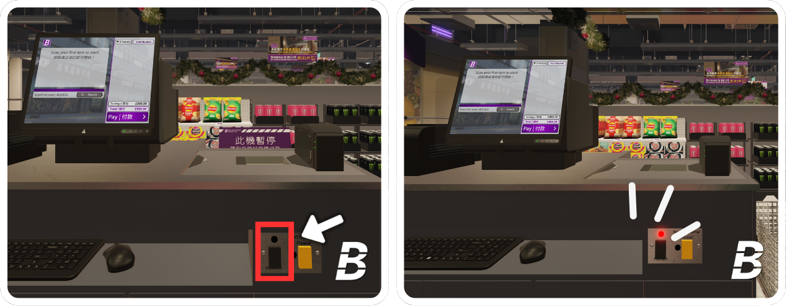
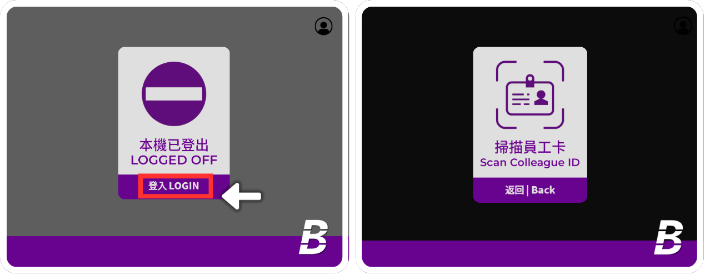
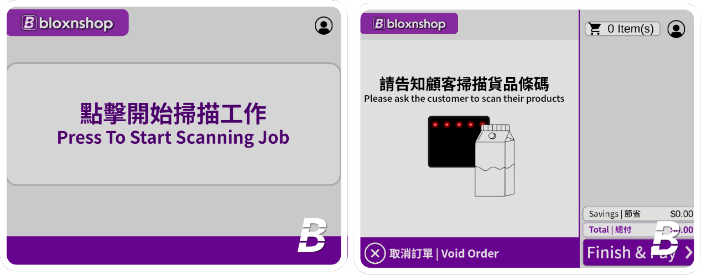
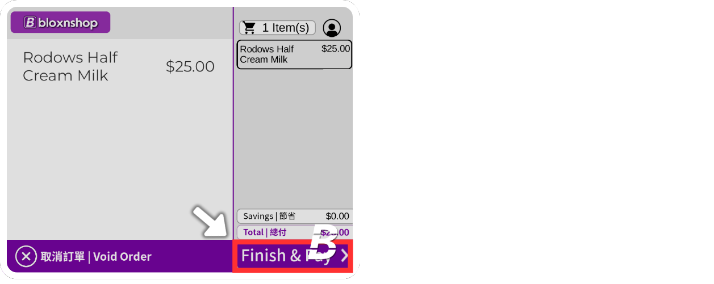
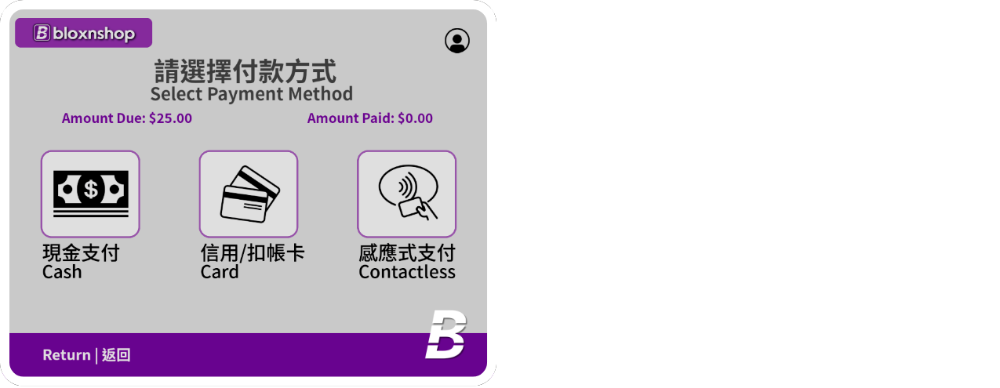
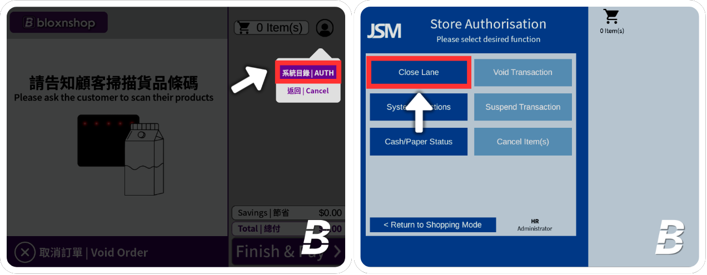
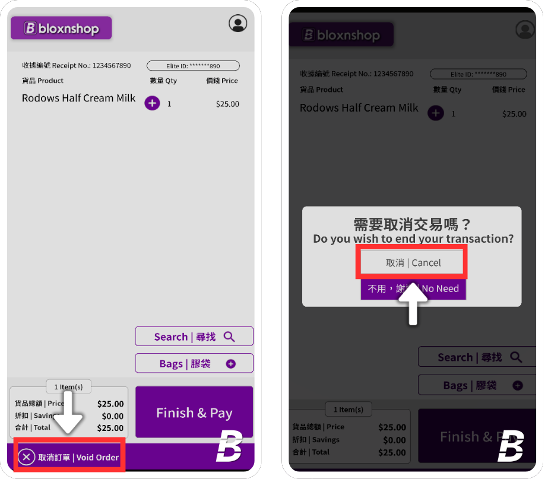

# 5 | Instructions of Duty

## Instructions for Manual Checkout Machine Duty



## Open/Close the tills

Inside the tills, locate a grey panel with 2 buttons.&#x20;

Press the **Power** dark button to activate the till; the <mark style="color:red;">LED light</mark> will turn <mark style="color:red;">red</mark>, and the <mark style="color:green;">lane light</mark> will turn <mark style="color:green;">green</mark>.

The **Lane Close** sign will automatically be removed once powered on.

(Note: If you want to serve the next customer, press the **Next Customer Please!** yellow button and an announcement will be made.)

<figure><figcaption></figcaption></figure>




## Login

When the Manual Checkout Machine is logged off, please press **Store Login**, then scan your **Operator Barcode**.

<figure><figcaption></figcaption></figure>




## Start the Scanning Job

Here is the main screen of the Manual Payment Machine. You should instruct the customer to scan their products.

<figure><figcaption></figcaption></figure>




Once the items are scanned, the screen will display the item names. After finishing the scanning process, press **Finish & Pay**.

To void the customer's transaction, press **Void Order** and click **Yes**.

<figure><figcaption></figcaption></figure>




You should instruct the customer to choose the payment options and complete the process.

<figure><figcaption></figcaption></figure>




Once payment is successful, the screen will show **Completed The Scanning Job**. The receipt will be automatically printed for customers. You should bid farewell to the customer after completing the payment process.

<figure><figcaption></figcaption></figure>




## Logoff

After finishing your duty, please log off the manual checkout machine and close the tills. Press **AUTH**, scan your operator barcode, and then press **Close Lane**.

<figure><figcaption></figcaption></figure>




***

## Instructions for Voiding an Order at the Self-Service Checkout

When the customer requests to clear all items / No one is operating the Self-Service Checkouts, press the **Void Order** button.

<figure><figcaption></figcaption></figure>

