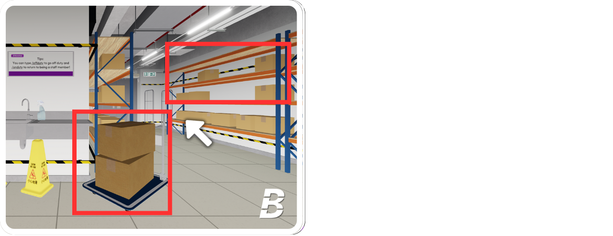

# 5.2 | Instructions for Restocking Duty



## Take the Restocking Box/Trolley

Go to the **Warehouse** and find the box located next to the sink, shelf, or trolley. Press the interact button to pick it up.

<figure><figcaption></figcaption></figure>




## Find the shelves that need restocking

When a shelf is out of stock, it will display the message **“Restock Required.”** Take the restock box or trolley, and press **"E"** to restock the shelf. You will see a prompt that says "Equip Box to..." indicating that you need to press the button to proceed with restocking.

<figure><figcaption></figcaption></figure>




## Finish

Once you have restocked the items, the shelf will be full, and you will earn **2 points** for completing the task.

<figure><figcaption></figcaption></figure>



