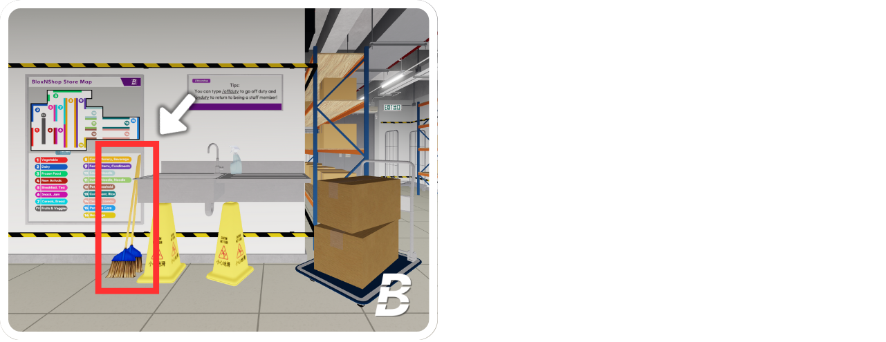
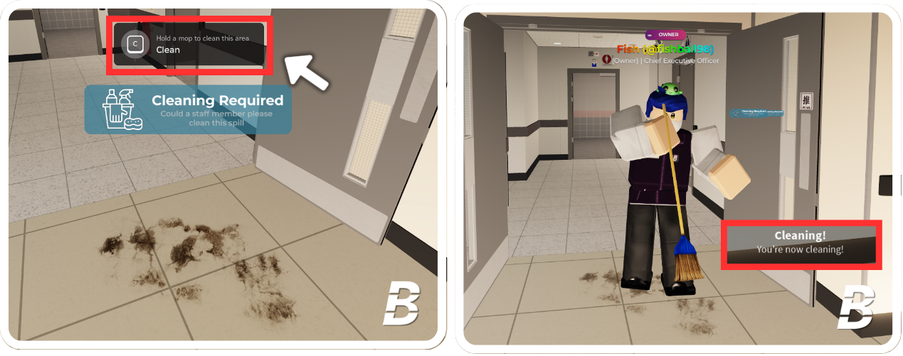

# 5.3 | Instructions for Janitor Duty



## Take the Broom

Go to the warehouse and locate the broom next to the sink. Press it to pick it up.

<figure><figcaption></figcaption></figure>




## Find Stains

Look for stains that randomly appear around the store. When you find one, press **"C"** to clean it. A "Cleaning!" message will appear at the bottom right corner of your screen once you click it, and a cleaning animation will start.

<figure><figcaption></figcaption></figure>




## Finish

After you complete the cleaning process, the stains will disappear, and you will earn **5 points**.

<figure><figcaption></figcaption></figure>



