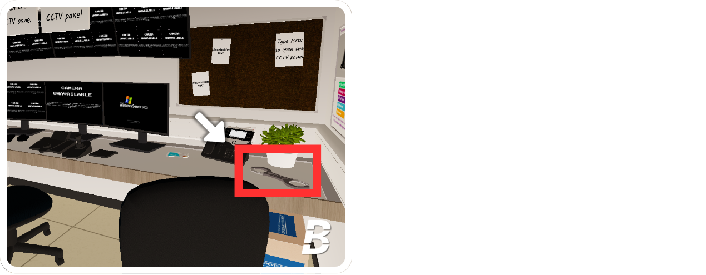
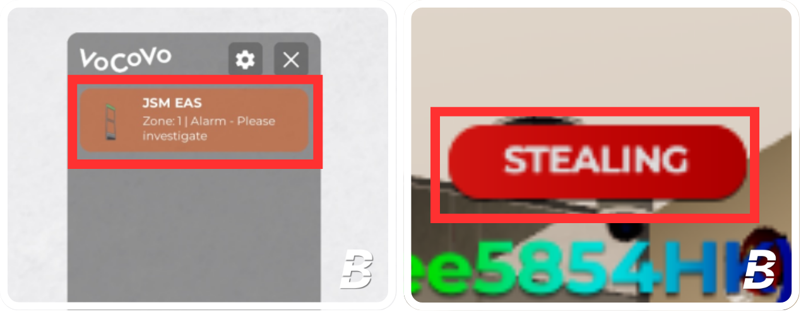
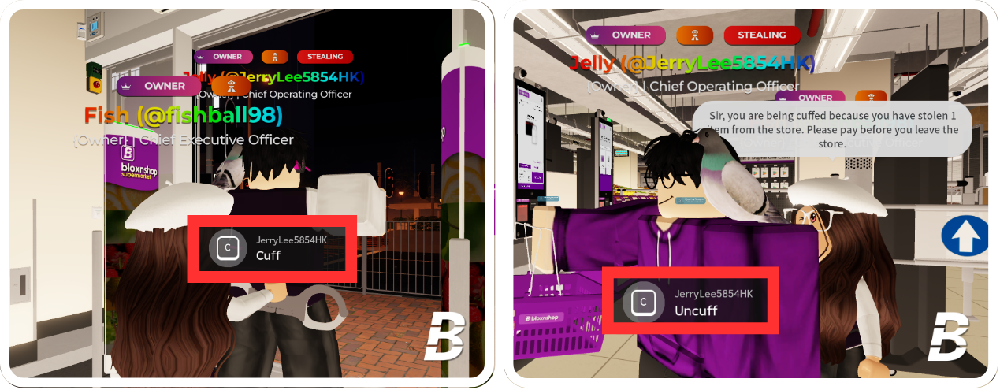

# 5.4 | Instructions for Security Duty

To promote security, please use <mark style="color:orange;">300 Points</mark> to purchase the Promotion Point System.

## Instructions for using the Handcuff



## Take the Handcuff

Go to the security room and locate the desk. Press it to equip up the handcuff.

<figure><figcaption></figcaption></figure>




## Definition of Thief

When customers leave the store and the EAS Gate sounds or VOCOVO indicates "Zone: 1 | Alarm," and the customer's nametag shows "STEALING," they are considered to be a thief.

<figure><figcaption></figcaption></figure>




## Cuff the Thief

When you identify a thief, equip your handcuff and cuff them by pressing **"C"**. Bring them back to the cashier **self-service checkout area** and uncuff them by pressing **"C"** again.
\
You **must inform** the stealers that they need to **pay before leaving the store**.
\
If necessary, specify the number of products they stole using the [Inventory Search Tool](5.4-or-instructions-for-security-duty.md#instructions-for-using-the-inventory-search-tool). If they are using a basket or trolley, instruct them to unload the items for payment.

<figure><figcaption></figcaption></figure>




## If the Behavior Continues

If the thief continues to steal items or trolling the EAS Gate, issue a informal warning to stop. If the behavior continues, please issue a formal warning.
\
For more information on moderation, please refer to [2 | Moderation Guide](../moderation-guide.md).

<figure><figcaption></figcaption></figure>




***

## Instructions for using the Inventory Search Tool

To check the number or names of items that the thief has stolen, you may use the Inventory Search Tool.
\
Click on the top bar "Staff Utilities" and select "Inventory Search Tool." Enter the thief's username (not the display name) to view all relevant details.

<figure><figcaption></figcaption></figure>

***

## Reminder

Please note that all cuffs and warnings will be recorded. Adhere to the [1 | Staff of Conduct](../staff-code-of-conduct.md) and the [2 | Moderation Guide](../moderation-guide.md) when dealing with stealers. If you issue a warning a customer without a valid reason, or if it is done intentionally, you may receive a warning, demotion, or risk being blacklisted, depending on the severity of the action.
